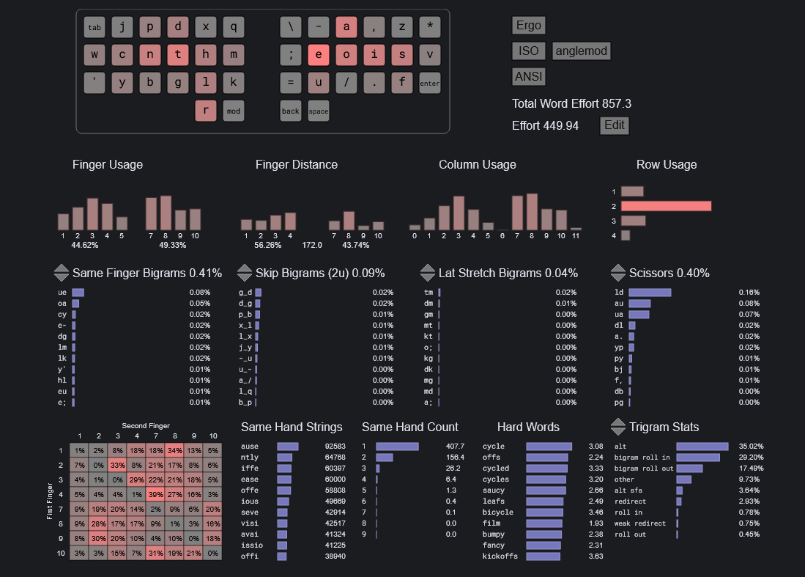
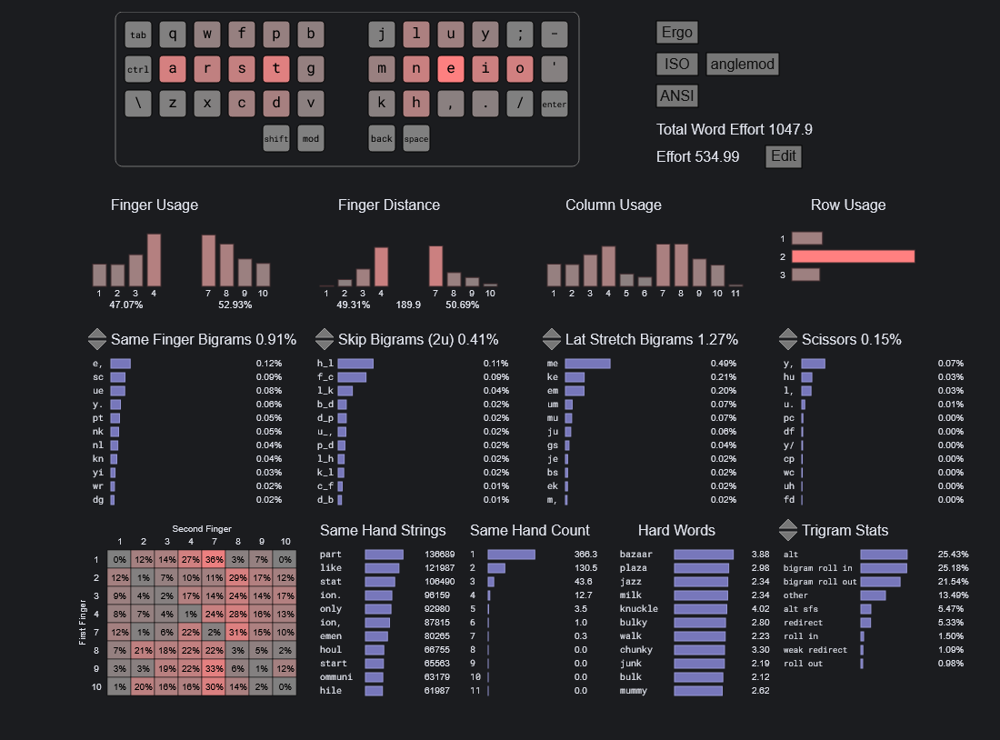
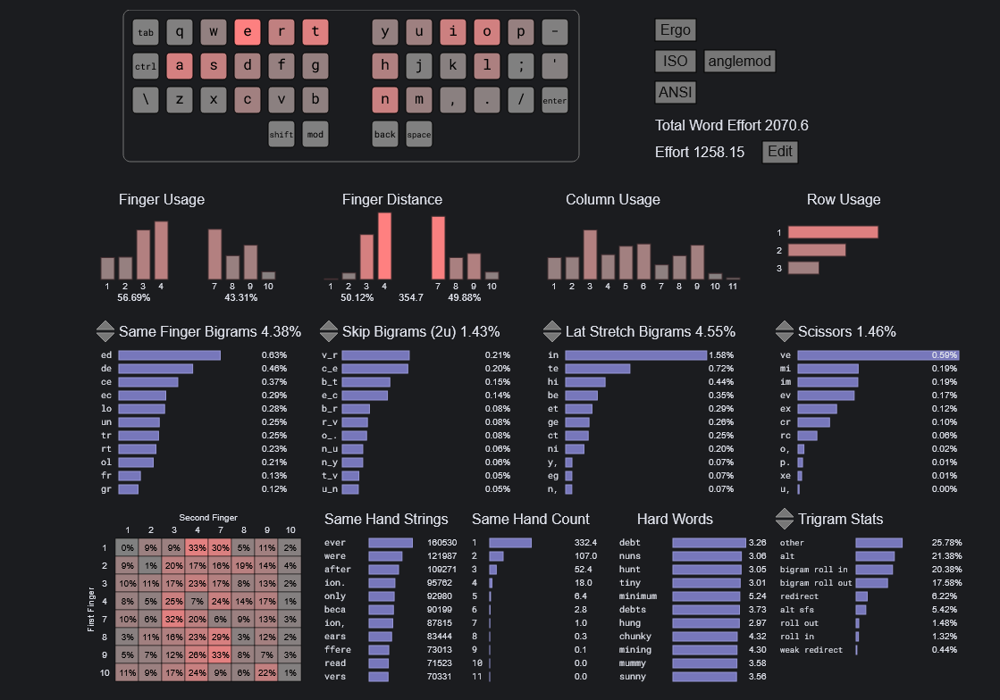

# Typeractive Corne Config

## Layers

### Symbols

```text
   ? ! - \ @  # % + = `
 " < [ { ( ;  : ) } ] > '
<- , ~ ^ / _  $ * | & . ->
```

The symbols layer is designed with programming in mind.
The middle row is for brackets and quotes.
I tried to keep things that add on the right and things that subtract on the left.
Top row logical operators ``! - + =`` are mirrored with bottom row bitwise operators ``~ ^ | &``.
Above and below the index fingers are the division ``/ %`` and multiplication symbols ``*``, as well as the backslash ``\`` above the forwardslash ``/`` for symmetry.
Having the slash ``/`` and asterisk ``*`` symbols on opposite fingers makes ``C++`` block comments easy to type.
The remaining symbols have been packed into the corners and in the inner columns in positions that make the most sense for my usage.
The dollar symbol ``$`` is on the right hand side of the keyboard as it indicates the end of the line in REGEX and VIm.
The caret ``^`` is on the left with the same reasoning.
The hash ``#`` symbol is on the right so that block comments in ``<# powershell #>`` are easier to open than close. The editor will probably add the ``#>`` after your cursor when you open one, depending on which one you use.
The semicolon ``;`` symbol is on the left because it is often typed after a right bracket.
The minus ``-`` and underscore ``_`` keys are both on the left because I have those keys on the top layer on the right hand side for typing strings that can't have spaces.

### Numbers

The numbers layer is a dual numpad with ``0`` on the pinkie fingers.
This lets you avoid the problem of only having 8-9 fingers for 10 numbers while holding layer keys with your thumbs.
This also allows you to use a standard numpad you're already used to without the same finger bigrams. ``147``, ``258``, ``369``
Now that I'm used to it I'm able to alternate hands while typing in numbers.

### Layouts

#### Tressym

```text
  j p d x q  / T a , z
w c n t h m  - e o i s v
  y b g l k  _ u ? . f
        R r  S '
```



This is my own custom layout.
I used [cyanophage](https://cyanophage.github.io) to optimise it.

#### Colemak DH

```
q w f p b  j l u y ?
a r s t g  m n e i o
z x c d v  k h , . '
```



#### QWERTY

```
q w e r t  y u i o p
a s d f g  h j k l ;
z x c v b  n m , . /
```



#### [Enthium](https://github.com/sunaku/enthium/tree/main)

```text
  z w d l x = u o y q
f s n t h k - e a i c b
  v p g m j / ; . , '
      r R     S '
```


